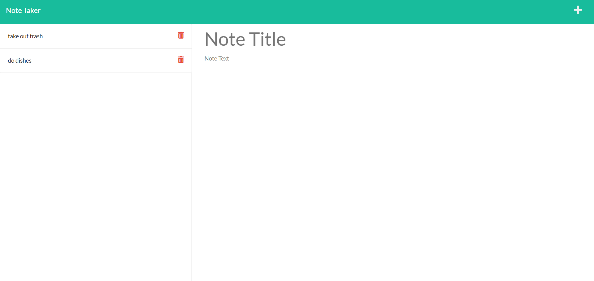

# Note Taker!

  ## Description
  Keep yourself Organized by creating notes and deleting them when they are no longer needed!

  # Table of Contents
 [Installation](#install)
 [Test](#test)
 [Usage](#usage)
 [Tech](#tech)
 [Deployment](#deployment)
 
 [Contributions](#contributions)
 [Contact](#contact)

  

  ## Usage
  1. After launching the app, click "Get Started"
  2. Add a title to your note and a brief description
  3. Click the trash icon next to your note when its no longer needed

  ## Tech
  - JavaScript
- CSS
- HTML
- NodeJS

  ## Deployment
  https://note-taker-qh.herokuapp.com/

  

  ## Contributions
  This was a solo Project
  
  ## Contact
  for any questions or inquaries send me an email at quentinhnilica@gmail.com and follow [my Github](https://www.github.com/quentinhnilica)
